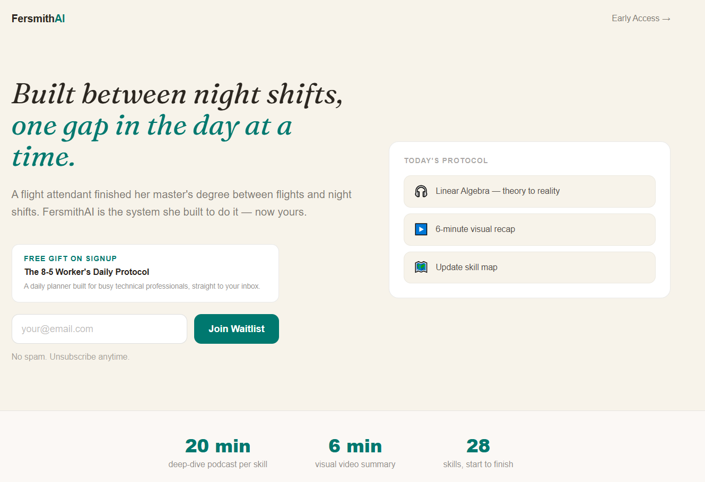
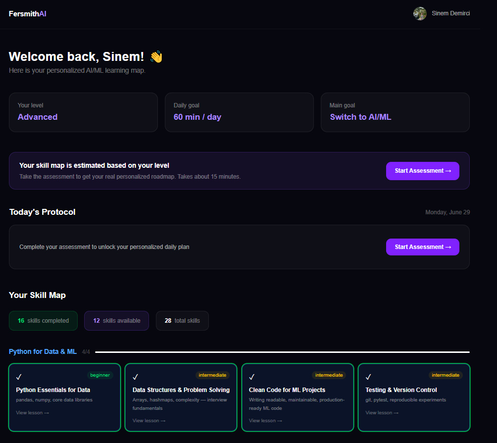

# Sinem Demirci — Portfolio Site

**Live URL:** https://sinemciftcidemirci.com  
**GitHub repo:** https://github.com/SinemCiftciDemirci/SinemCiftciDemirci.github.io  
**Local path:** `C:\Users\Axel\Desktop\Projects\Sinem Demirci Portfolio`

## Tech stack

- Static HTML/CSS/JS — no build step
- Bootstrap 5 (Start Bootstrap Resume theme v7.0.6)
- Deployed via GitHub Actions → GitHub Pages
- Custom domain via Namecheap DNS

## Key files

| File | Purpose |
|------|---------|
| `index.html` | All page content |
| `css/styles.css` | Custom overrides on top of Bootstrap |
| `js/scripts.js` | Bootstrap scrollspy + navbar collapse (do not touch) |
| `.github/workflows/deploy.yml` | GitHub Actions deploy workflow |

## Color palette (brand)

| Role | Hex |
|------|-----|
| Background (cream) | `#F7F3EA` |
| Accent (teal) | `#0F766E` |
| Text (dark ink) | `#2B2620` |
| Sidebar gradient | `#0F766E → #065f57 → #2B2620` |

CSS variables set at top of `styles.css`:
```css
--bs-primary-rgb: 15, 118, 110;
--bs-primary: #0F766E;
--bs-link-color: #0F766E;
```

## Image folders

```
assets/img/
  profile.jpg
  fersmithai/       1.PNG … 5.PNG
  skyanalystai/     1.PNG … 3.PNG
  childrentalesummarizer/  1.jpg … 3.jpg
```

**Important:** folder names are all lowercase. Windows git doesn't detect case-only renames — use `git rm --cached` + `git add` if renaming.

## Tabbed image viewer

Projects use a custom tab system (not Bootstrap tabs). HTML pattern:

```html
<div class="project-tabs mb-2" data-project="fersmith">
    <button class="tab-btn active" data-tab="1">Screen 1</button>
    <button class="tab-btn" data-tab="2">Screen 2</button>
    ...
</div>
<div class="project-img-wrapper">
    
    
    ...
</div>
```

JS lives at end of `index.html` body (not in `scripts.js`) using `DOMContentLoaded` + `data-project` / `data-tab` attributes.

## fersmith.ai links

All 3 links on the page use UTM parameters:
```
https://fersmith.ai/?utm_source=portfolio&utm_medium=referral&utm_campaign=portfolio_link
```
Locations: hero subheading, globe social icon, "Visit fersmith.ai" button in Projects section.

## Deploy workflow

`.github/workflows/deploy.yml` — key behaviors:
- Triggers on push to `main` and `workflow_dispatch`
- **Deletes old `github-pages` artifacts before uploading new one** (prevents "Multiple artifacts" error)
- `concurrency: cancel-in-progress: true` to avoid parallel runs
- Permissions include `actions: write` (needed for artifact deletion)

To deploy: just `git push`. The workflow runs automatically.

## Git remote

```
origin → https://github.com/SinemCiftciDemirci/SinemCiftciDemirci.github.io.git
```

## Sections (in order)

1. **About** — headline, bio, social icons (LinkedIn, GitHub, email, globe→fersmith.ai)
2. **Experience** — FersmithAI (AI Engineer, solo founder), Uptrail (Data Analyst intern)
3. **Education** — MSc + BSc
4. **Skills** — Programming Languages / Libraries & AI Frameworks / AI-Assisted Workflow & Tools
5. **Projects** — FersmithAI → SkyAnalyst-AI → Children's Tale Summarizer
6. **Certificates** — ordered by relevance (most relevant first)

## Projects summary

| Project | Status | GitHub | Live |
|---------|--------|--------|------|
| FersmithAI | In Progress | public | fersmith.ai |
| SkyAnalyst-AI | Completed | public | — |
| Children's Tale Summarizer | Completed | public | — |
